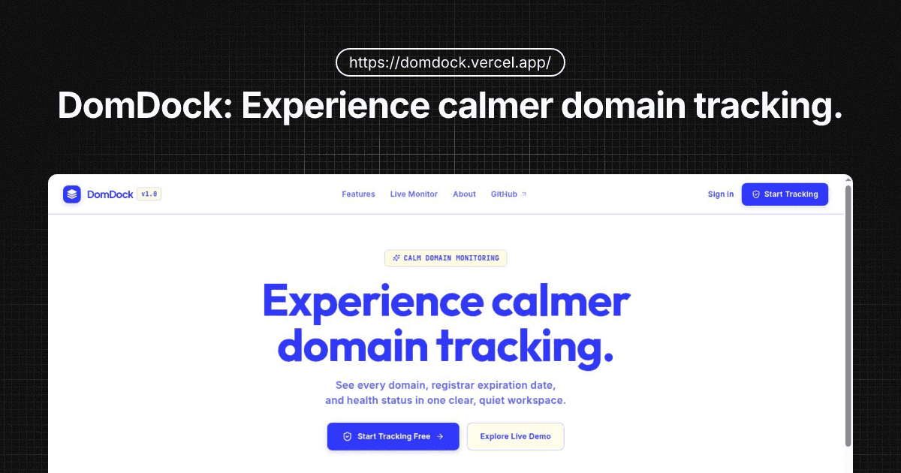

<p align="center">
  
</p>

<h1 align="center">DomDock</h1>

<p align="center">
  <strong>Calm Domain Monitoring</strong> — Track every domain, registrar expiration date, and health status in one clear, quiet workspace.
</p>

<p align="center">
  <a href="#-features"><strong>Features</strong></a> ·
  <a href="#-tech-stack"><strong>Tech Stack</strong></a> ·
  <a href="#-getting-started"><strong>Getting Started</strong></a> ·
  <a href="#-project-structure"><strong>Project Structure</strong></a>
</p>

<br/>



DomDock is a modern web application designed for web creators, developers, and agency owners to effortlessly monitor domain expiry dates, HTTP/HTTPS availability, status codes, SSL certs, and DNS records. Built with **Next.js 16**, **React 19**, **Supabase**, and **Tailwind CSS**, DomDock combines robust real-time monitoring with Arc-inspired design aesthetics.

---

## ✨ Features

- 🔍 **Instant Live Domain Inspector**: Look up domain expiration (via RDAP protocol), website status, and DNS records live right from the home page.
- 🛡️ **Personalized Monitoring Dashboard**: Authenticated workspace at `/dashboard` to add, view, refresh, inspect detailed DNS records, and manage tracked domains.
- ⏳ **Expiry Countdowns & Warning Alerts**: Visual alerts for domains nearing registration expiration (within 30 days) and offline/unreachable sites.
- ⚡ **Real-Time Health Diagnostics & Redirect Handling**: Measures response latency (ms), status codes (`200 OK`, `307 Redirect`, `404`, `500`), and safe SSRF redirect guards.
- 🌐 **Cookie-Free Domain Favicons**: High-resolution favicon integration powered by the Favicone API (`favicone.com`).
- 💡 **User Feature Requests**: Built-in modal and API route (`/api/feature-request`) allowing visitors and users to submit feature ideas.
- 🔒 **Secure Supabase Auth**: Password authentication, server-side session checks, and RLS (Row Level Security) data isolation via `@supabase/ssr`.

---

## 🛠️ Tech Stack

- **Framework**: [Next.js 16](https://nextjs.org/) (App Router, Turbopack, Cache Components) & [React 19](https://react.dev/)
- **Backend & Database**: [Supabase](https://supabase.com/) (`@supabase/supabase-js`, `@supabase/ssr`)
- **Styling & UI**: [Tailwind CSS](https://tailwindcss.com/), [Lucide React](https://lucide.dev/)
- **External Protocols & APIs**: RDAP (Registration Data Access Protocol) via `rdap.org`, Favicone API, Node.js `dns/promises`
- **Language**: TypeScript

---

## 🚀 Getting Started

### Prerequisites

- **Node.js**: v20.0.0 or higher
- **Package Manager**: `npm`, `pnpm`, or `yarn`
- **Supabase Project**: Create a free project at [supabase.com](https://supabase.com)

### 1. Clone the Repository

```bash
git clone https://github.com/yshnv/domdock.git
cd domdock
```

### 2. Install Dependencies

```bash
npm install
```

### 3. Configure Environment Variables

Create a `.env.local` file in the root directory:

```env
NEXT_PUBLIC_SUPABASE_URL=your_supabase_project_url
NEXT_PUBLIC_SUPABASE_PUBLISHABLE_KEY=your_supabase_publishable_or_anon_key
```

### 4. Set Up Supabase Database Schema

Run the following SQL script in your **Supabase SQL Editor** to create the necessary tables, RLS policies, and triggers:

```sql
-- 1. Main Domains Table
CREATE TABLE IF NOT EXISTS public.domains (
  id UUID DEFAULT gen_random_uuid() PRIMARY KEY,
  user_id UUID REFERENCES auth.users(id) ON DELETE CASCADE NOT NULL,
  name TEXT NOT NULL,
  expires_at DATE,
  health TEXT CHECK (health IN ('healthy', 'warning', 'offline', 'pending')) DEFAULT 'pending',
  last_checked_at TIMESTAMPTZ,
  status_code INTEGER,
  response_time_ms INTEGER,
  dns_records JSONB,
  created_at TIMESTAMPTZ DEFAULT timezone('utc'::text, now()) NOT NULL
);

ALTER TABLE public.domains ENABLE ROW LEVEL SECURITY;

CREATE POLICY "Users can manage their own domains"
  ON public.domains FOR ALL
  USING (auth.uid() = user_id)
  WITH CHECK (auth.uid() = user_id);

-- 2. Domain Monitoring Detail Table
CREATE TABLE IF NOT EXISTS public.domain_monitoring (
  id UUID DEFAULT gen_random_uuid() PRIMARY KEY,
  domain_id UUID REFERENCES public.domains(id) ON DELETE CASCADE UNIQUE NOT NULL,
  registrar_name TEXT,
  registrar_iana_id TEXT,
  registrar_url TEXT,
  dns_provider TEXT,
  nameservers TEXT[],
  hosting_provider TEXT,
  ssl_valid BOOLEAN,
  ssl_issuer TEXT,
  ssl_subject TEXT,
  ssl_valid_from TIMESTAMPTZ,
  ssl_valid_to TIMESTAMPTZ,
  ssl_days_remaining INTEGER,
  ssl_hostname_matches BOOLEAN,
  ssl_serial_number TEXT,
  https_available BOOLEAN,
  website_online BOOLEAN,
  website_status_code INTEGER,
  website_response_time_ms INTEGER,
  website_final_url TEXT,
  website_redirect_count INTEGER DEFAULT 0,
  health_score INTEGER DEFAULT 100,
  email_has_mx BOOLEAN,
  email_spf_record TEXT,
  email_dmarc_record TEXT,
  email_dkim_records TEXT[],
  last_checked_at TIMESTAMPTZ,
  created_at TIMESTAMPTZ DEFAULT timezone('utc'::text, now()) NOT NULL,
  updated_at TIMESTAMPTZ DEFAULT timezone('utc'::text, now()) NOT NULL
);

ALTER TABLE public.domain_monitoring ENABLE ROW LEVEL SECURITY;

CREATE POLICY "Users can view domain_monitoring via domain ownership"
  ON public.domain_monitoring FOR SELECT
  USING (EXISTS (SELECT 1 FROM public.domains d WHERE d.id = domain_monitoring.domain_id AND d.user_id = auth.uid()));

-- 3. Feature Requests Table
CREATE TABLE IF NOT EXISTS public.feature_requests (
  id UUID DEFAULT gen_random_uuid() PRIMARY KEY,
  user_id UUID REFERENCES auth.users(id) ON DELETE SET NULL,
  title TEXT NOT NULL,
  category TEXT DEFAULT 'General',
  description TEXT NOT NULL,
  contact_email TEXT,
  created_at TIMESTAMPTZ DEFAULT timezone('utc'::text, now()) NOT NULL
);

ALTER TABLE public.feature_requests ENABLE ROW LEVEL SECURITY;

CREATE POLICY "Anyone can submit feature requests"
  ON public.feature_requests FOR INSERT
  WITH CHECK (true);
```

### 5. Run the Local Development Server

```bash
npm run dev
```

Open [http://localhost:3000](http://localhost:3000) in your browser.

---

## 📁 Project Structure

```text
domdock/
├── app/
│   ├── api/
│   │   ├── check-domain/        # Real-time RDAP, DNS & HTTP inspector
│   │   ├── feature-request/     # Feature request submission route
│   │   └── domains/[id]/        # Domain checking, events & monitoring API
│   ├── auth/                    # Sign-up, Login, Forgot & Reset password pages
│   ├── dashboard/               # Authenticated Workspace Dashboard & Detail views
│   ├── globals.css              # Design tokens & base CSS
│   ├── layout.tsx               # Root layout & Metadata configuration
│   ├── page.tsx                 # Landing page with Live Control Room & About section
│   ├── robots.ts                # Search engine robots.txt generator
│   └── sitemap.ts               # Dynamic sitemap.xml generator
├── components/
│   ├── arc-header.tsx           # Navigation header component
│   ├── arc-feature-bento.tsx    # Asymmetric feature bento grid
│   ├── domain-health-widget.tsx # Live domain inspector card
│   ├── feature-request-modal.tsx# Feature request submission modal
│   └── domdock-logo.tsx         # SVG logo mark
├── lib/
│   ├── monitoring/              # RDAP, DNS, SSL, and HTTP availability engines
│   └── supabase/                # Supabase client & server SSR factories
├── public/
│   ├── llms.txt                 # Agentic AI documentation file
│   └── logo.svg                 # Brand mark SVG
└── package.json                 # Dependencies & version definition (v1.0.0)
```

---

## 📜 Available Scripts

| Script          | Command         | Description                       |
| :-------------- | :-------------- | :-------------------------------- |
| **Development** | `npm run dev`   | Starts Next.js development server |
| **Build**       | `npm run build` | Builds production bundle          |
| **Start**       | `npm run start` | Starts production server          |
| **Lint**        | `npm run lint`  | Runs ESLint checks                |

---

## 📄 License

Distributed under the MIT License. See `LICENSE` for more information.
